<div align="center">

# Netflix Content Intelligence

### Global Performance · Content Lifecycle · Market Intelligence · Forecasting

<p>
  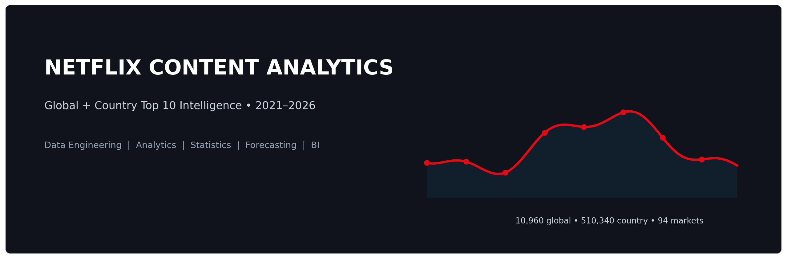
</p>

<p>
  
  
  
  
</p>

**A reproducible analytics project built around Netflix's publicly available Top 10 data.**

[Explore the visuals](#-visual-gallery) · [Understand the analysis](#-analytical-framework) · [Forecast benchmark](#-forecasting--machine-learning) · [Get started](#-get-started)

</div>

---

## At a glance

<table>
  <tr>
    <td align="center" width="25%"><h2>10,960</h2><b>Global observations</b><br><sub>Weekly title records</sub></td>
    <td align="center" width="25%"><h2>510,340</h2><b>Country observations</b><br><sub>Weekly market records</sub></td>
    <td align="center" width="25%"><h2>94</h2><b>Audience markets</b><br><sub>Country-level coverage</sub></td>
    <td align="center" width="25%"><h2>274</h2><b>Weeks covered</b><br><sub>Jul 2021 – Sep 2026</sub></td>
  </tr>
  <tr>
    <td align="center"><b>25 / 25</b><br><sub>SQL analyses reported passing</sub></td>
    <td align="center"><b>37 / 37</b><br><sub>Automated tests reported passing</sub></td>
    <td align="center"><b>64 / 64</b><br><sub>Manifest hashes reported matching</sub></td>
    <td align="center"><b>13 pages</b><br><sub>Streamlit dashboard</sub></td>
  </tr>
</table>

> **Audit note:** Counts and test totals shown here come from the supplied project audit; they were not re-run as part of this README update.
>
> **Measurement boundary:** Netflix Top 10 data describes titles appearing in published rankings. It does **not** measure viewing across the entire Netflix catalogue. A title missing from the Top 10 must not be treated as having zero views.

## What this project does

The project brings together data ingestion, data-quality checks, normalized analytical tables, SQL analysis, statistical testing, lifecycle measurement, market comparisons, forecasting, model diagnostics, and an interactive dashboard.

<table>
  <tr>
    <td width="50%" valign="top">
      <h3>🎬 Business & market intelligence</h3>
      <ul>
        <li>Global weekly performance and rank trends</li>
        <li>Country-level audience-market comparisons</li>
        <li>Title retention, returns, and drop-off</li>
        <li>Cohorts, survival analysis, and right-censoring</li>
        <li>Content concentration and market breadth</li>
        <li>Breakout detection and short-term momentum</li>
      </ul>
    </td>
    <td width="50%" valign="top">
      <h3>🧪 Analytics engineering & modelling</h3>
      <ul>
        <li>Source contracts and data-quality validation</li>
        <li>25 SQL analysis modules</li>
        <li>Effect sizes, hypothesis tests, and FDR control</li>
        <li>Chronological next-week views forecasting</li>
        <li>Permutation importance and SHAP when available</li>
        <li>Provenance manifests, hashes, tests, and SQLite</li>
      </ul>
    </td>
  </tr>
</table>

## The workflow

<table>
  <tr>
    <td align="center" width="16%"><h3>01</h3>📥<br><b>INGEST</b><br><sub>Official Netflix TSVs</sub></td>
    <td align="center" width="16%"><h3>02</h3>🧹<br><b>VALIDATE</b><br><sub>Schema · grain · quality</sub></td>
    <td align="center" width="16%"><h3>03</h3>🧱<br><b>MODEL</b><br><sub>Normalized data marts</sub></td>
    <td align="center" width="16%"><h3>04</h3>🔎<br><b>ANALYZE</b><br><sub>SQL · statistics · lifecycle</sub></td>
    <td align="center" width="16%"><h3>05</h3>🤖<br><b>FORECAST</b><br><sub>Time-aware ML evaluation</sub></td>
    <td align="center" width="16%"><h3>06</h3>📊<br><b>DELIVER</b><br><sub>Dashboard · reports · tests</sub></td>
  </tr>
</table>

## ✨ Visual gallery

The gallery follows the analytical story: system design and project scale, performance, lifecycle and market behaviour, statistical evidence, forecasting, and data quality. The Netflix H1 2026 visuals are contextual references and are kept separate from the weekly Top 10 facts.

<table>
  <tr>
    <td width="50%" valign="top">
      <h3>1. System architecture</h3>
      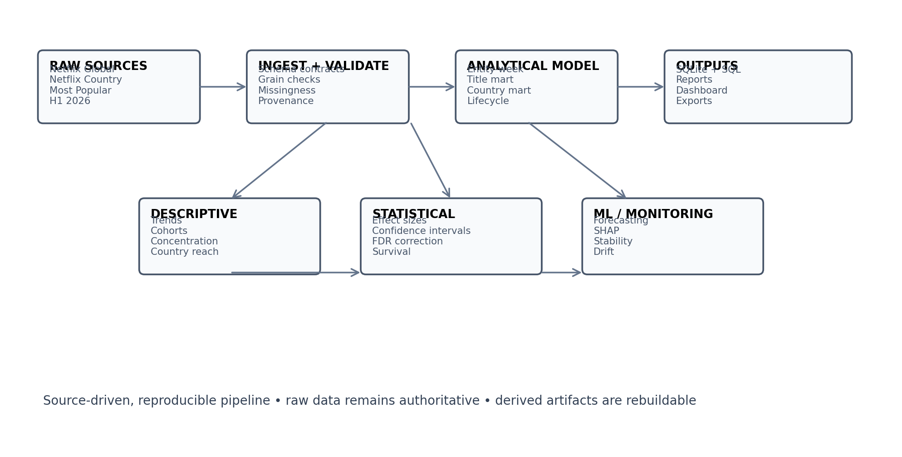
      <sub>From official sources through validation, analytics, modelling, and reporting.</sub>
    </td>
    <td width="50%" valign="top">
      <h3>2. Project at a glance</h3>
      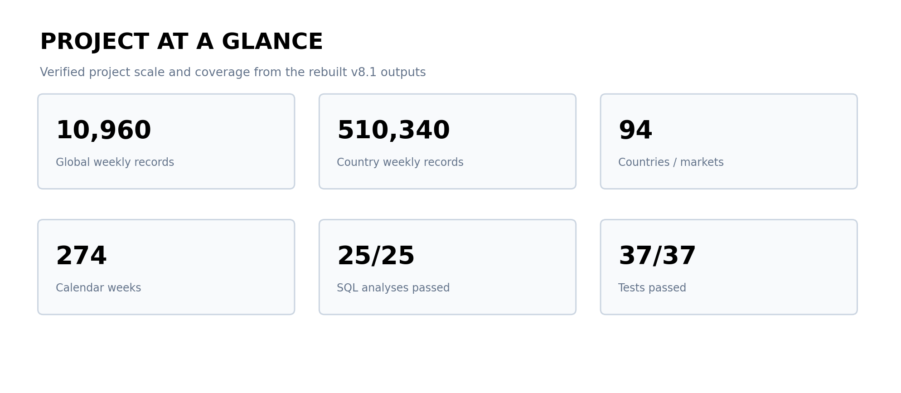
      <sub>Dataset size, market coverage, SQL modules, and tests.</sub>
    </td>
  </tr>
  <tr>
    <td valign="top">
      <h3>3. Global weekly performance</h3>
      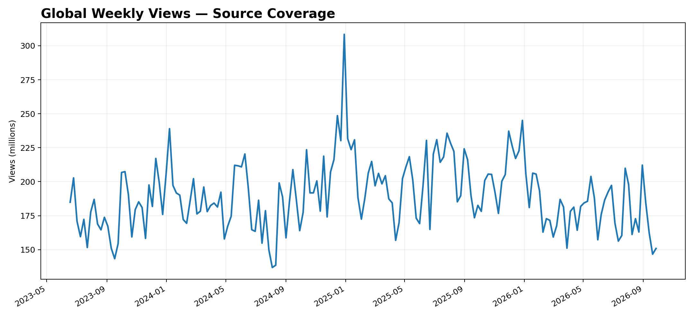
      <sub>Observed global Top 10 viewing activity over time.</sub>
    </td>
    <td valign="top">
      <h3>4. Country-market coverage</h3>
      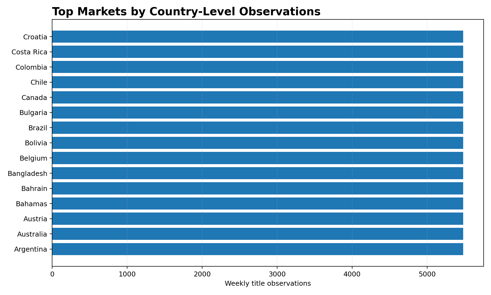
      <sub>Geographic breadth of audience-market observations, not production countries.</sub>
    </td>
  </tr>
  <tr>
    <td valign="top">
      <h3>5. Retention and churn</h3>
      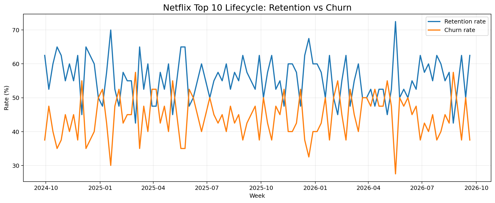
      <sub>Continuation, disappearance, and return across weekly observations.</sub>
    </td>
    <td valign="top">
      <h3>6. Global concentration</h3>
      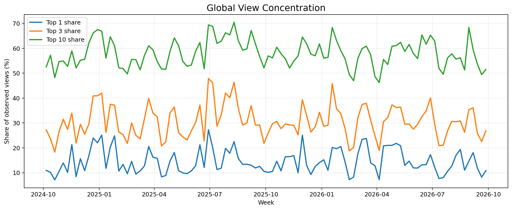
      <sub>Whether observed performance is broadly distributed or concentrated.</sub>
    </td>
  </tr>
  <tr>
    <td valign="top">
      <h3>7. Breakout titles</h3>
      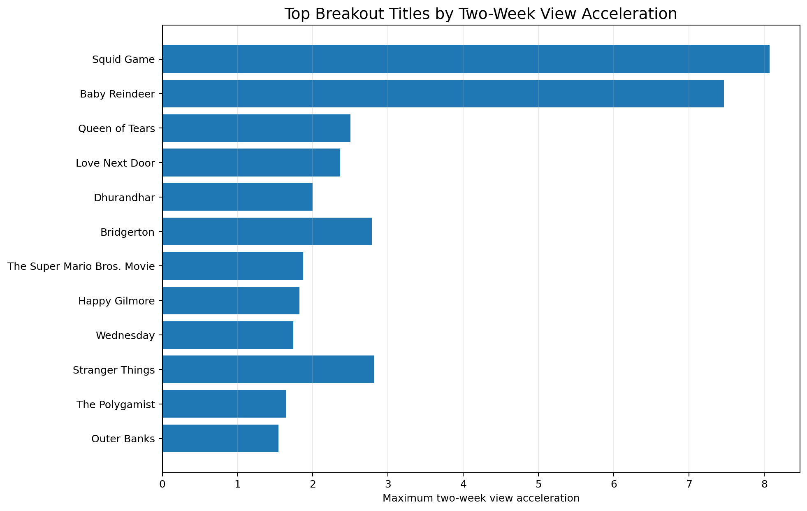
      <sub>Titles with unusual short-term acceleration under the project framework.</sub>
    </td>
    <td valign="top">
      <h3>8. Country similarity</h3>
      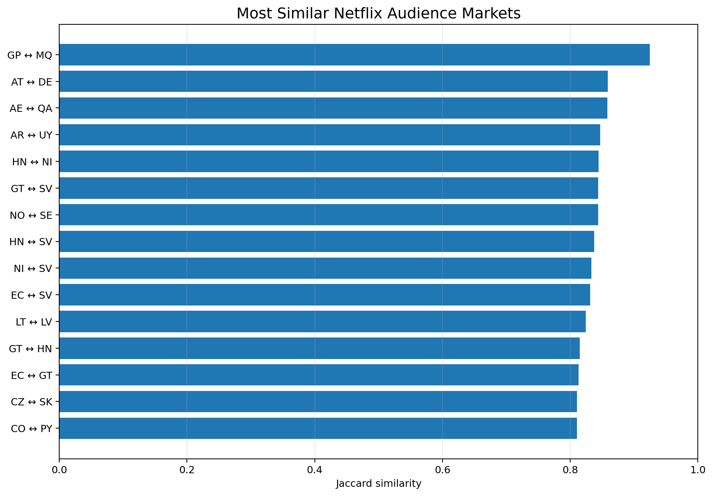
      <sub>Market similarities based on observed title-performance patterns.</sub>
    </td>
  </tr>
  <tr>
    <td valign="top">
      <h3>9. Statistical effects</h3>
      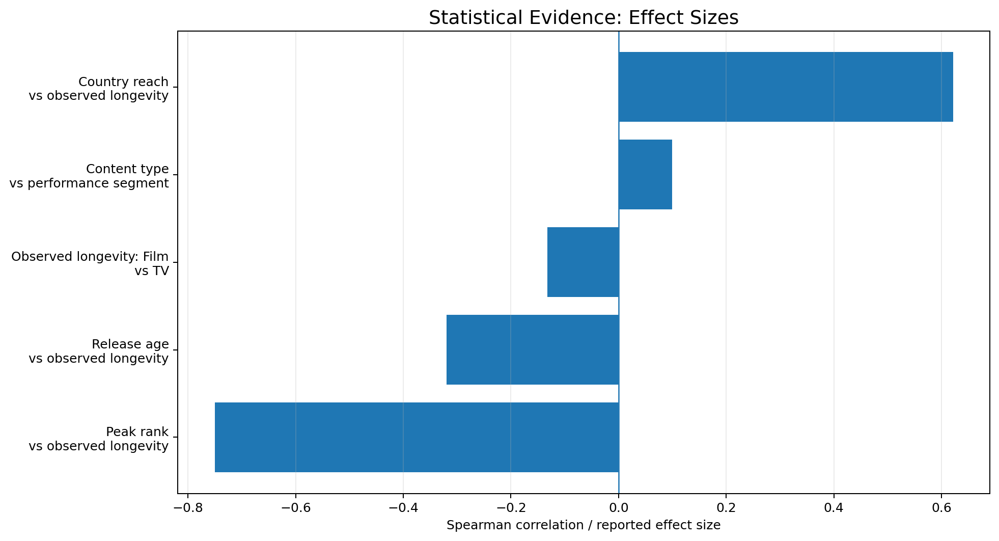
      <sub>Hypothesis-test evidence and effect sizes, with multiple-testing control where applicable.</sub>
    </td>
    <td valign="top">
      <h3>10. Forecast benchmark</h3>
      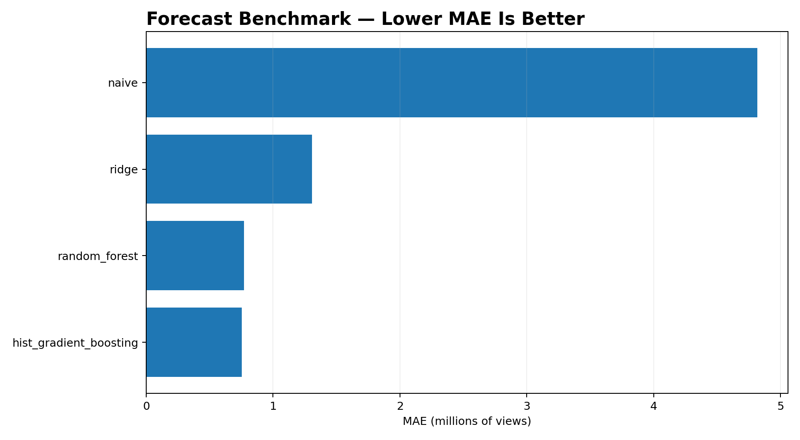
      <sub>Chronological holdout results compared with a naive baseline.</sub>
    </td>
  </tr>
  <tr>
    <td valign="top">
      <h3>11. Feature importance</h3>
      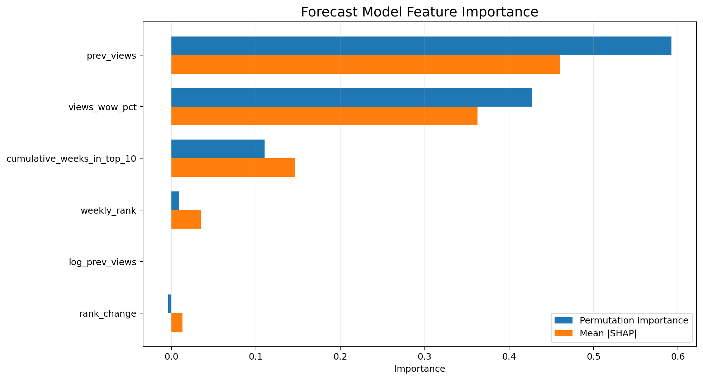
      <sub>Predictors contributing to forecast performance; importance is not causality.</sub>
    </td>
    <td valign="top">
      <h3>12. Model stability</h3>
      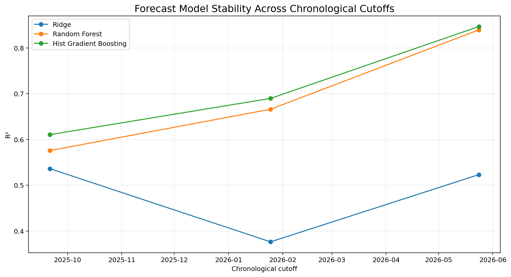
      <sub>Variation in model behaviour and errors across time or validation slices.</sub>
    </td>
  </tr>
  <tr>
    <td valign="top">
      <h3>13. Data coverage drift</h3>
      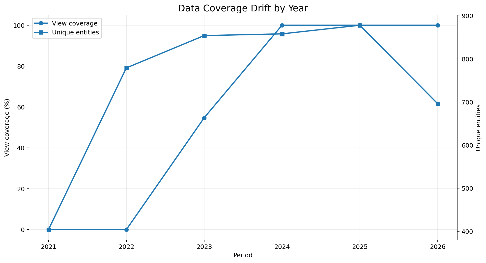
      <sub>Coverage changes that may affect interpretation of apparent trends.</sub>
    </td>
    <td valign="top">
      <h3>14. Cohort lifecycle</h3>
      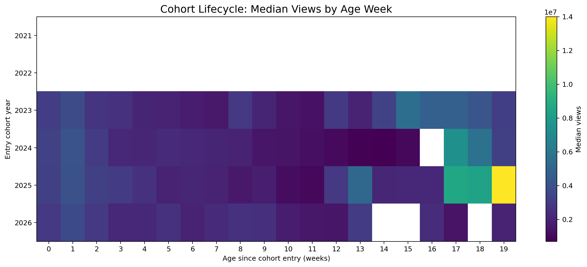
      <sub>Median observed views across lifecycle positions for title cohorts.</sub>
    </td>
  </tr>
  <tr>
    <td valign="top">
      <h3>15. Data quality</h3>
      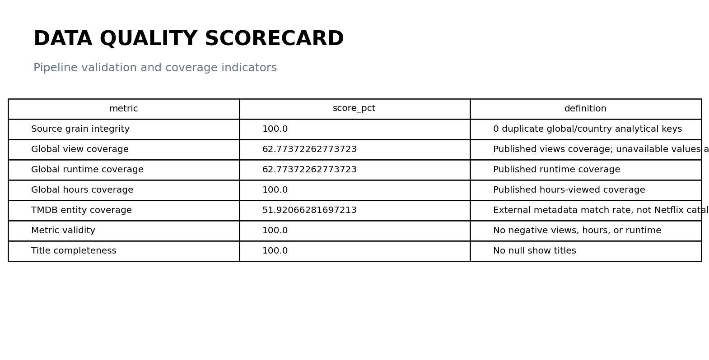
      <sub>Source grain, metric validity, coverage, title completeness, and metadata coverage.</sub>
    </td>
    <td valign="top">
      <h3>16. Netflix H1 2026 — Top Movies</h3>
      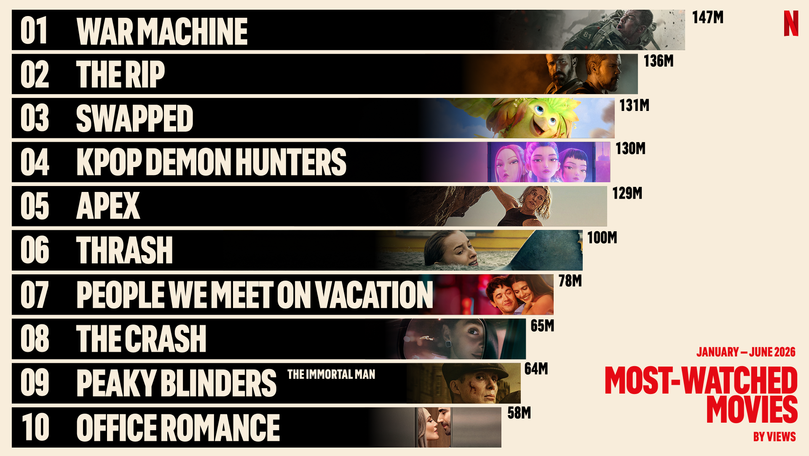
      <sub>Official Netflix reference visual, separate from weekly Top 10 data.</sub>
    </td>
  </tr>
  <tr>
    <td valign="top">
      <h3>17. Netflix H1 2026 — Top Shows</h3>
      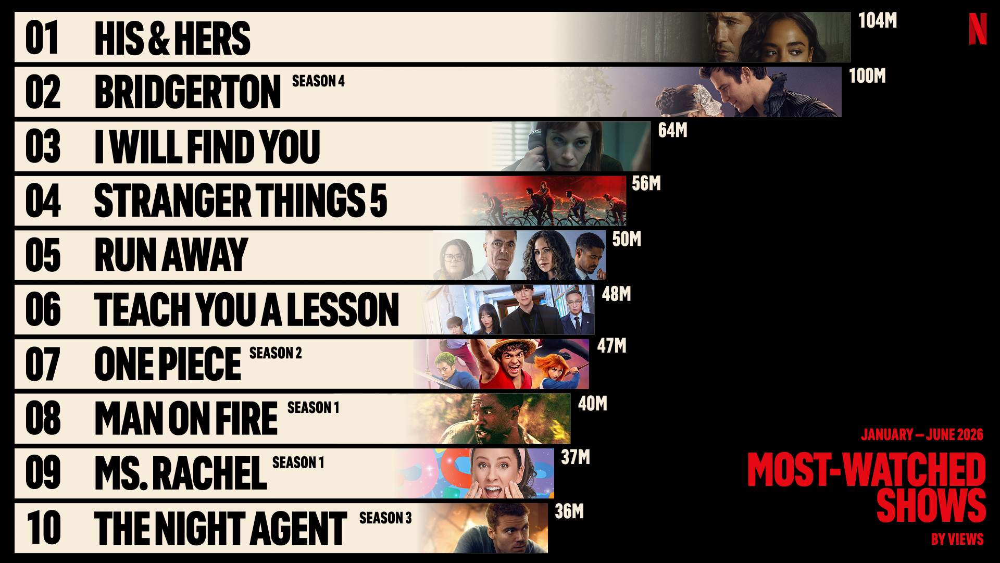
      <sub>Separate company-level reference, not a weekly Top 10 fact table.</sub>
    </td>
    <td valign="middle">
      <h3>Follow the evidence</h3>
      <p>Sources → scale → performance → lifecycle and markets → statistical evidence → forecasting → stability and quality.</p>
    </td>
  </tr>
</table>

## Official data sources

| Source | What it provides |
|---|---|
| [Global Weekly Top 10 TSV](https://www.netflix.com/tudum/top10/data/all-weeks-global.tsv) | Global weekly title performance |
| [Country Weekly Top 10 TSV](https://www.netflix.com/tudum/top10/data/all-weeks-countries.tsv) | Weekly performance by audience market |
| [Netflix Most Popular](https://www.netflix.com/tudum/top10/most-popular) | Separate first-91-days ranking |
| [Netflix Top 10 portal](https://www.netflix.com/tudum/top10) | Published interface and methodology context |
| [What We Watched — H1 2026](https://about.netflix.com/en/news/what-we-watched-the-first-half-of-2026) | Separate engagement-report reference |

Optional TMDB data is external reference metadata. It is not an authoritative Netflix-wide catalogue or a source of Netflix audience-performance data.

### Reported data scope

| Measure | Reported result |
|---|---:|
| Global weekly observations | 10,960 |
| Country weekly observations | 510,340 |
| Audience markets | 94 |
| Weekly coverage | 274 weeks |
| Coverage period | 2021-07-04 to 2026-09-27 |
| Current Most Popular records | 40 |
| Global source grain | 40 rows per week |
| Country source grain | 10 rows per category, week, and country |

## Architecture

```text
Official Netflix sources
        │
        ▼
Raw TSV / CSV ingestion
        │
        ▼
Validation: schema · grain · dates · duplicates · missingness · metric checks
        │
        ▼
Normalization: dates · entity keys · categories · content type
        │
        ▼
Analytical marts + SQLite
        │
        ├────────────────────────┐
        ▼                        ▼
   SQL analytics          Statistical analysis
        └────────────┬───────────┘
                     ▼
Lifecycle · Survival · Concentration · Market similarity · Breakouts
                     │
                     ▼
Chronological forecasting · Model interpretation · Stability / drift
                     │
                     ▼
Reports · CSV exports · Streamlit dashboard
```

## Analytical framework

<table>
  <tr>
    <td width="50%" valign="top">
      <h3>📈 Performance</h3>
      <ul>
        <li>Peak and average rank</li>
        <li>Peak views and hours</li>
        <li>Observed and elapsed longevity</li>
        <li>Rank volatility and performance segments</li>
      </ul>

      <h3>🔁 Lifecycle & survival</h3>
      <ul>
        <li>New, continuing, returning, and dropped titles</li>
        <li>Entry cohorts and weeks since entry</li>
        <li>Retention and survival curves</li>
        <li>Right-censoring at the observation boundary</li>
      </ul>

      <h3>🌍 Market intelligence</h3>
      <ul>
        <li>Country reach and title-market persistence</li>
        <li>Jaccard similarity between markets</li>
        <li>Top-1, Top-3, and Top-10 concentration</li>
        <li>Herfindahl–Hirschman Index (HHI)</li>
        <li>Global-versus-country comparisons</li>
      </ul>
    </td>
    <td width="50%" valign="top">
      <h3>🚀 Momentum & breakouts</h3>
      <ul>
        <li>Week-over-week movement and rank changes</li>
        <li>Two-week view acceleration</li>
        <li>New entries and cross-market expansion</li>
      </ul>

      <h3>🧪 Statistical evidence</h3>
      <ul>
        <li>Distribution and group comparisons</li>
        <li>Association analysis and effect sizes</li>
        <li>Hypothesis tests and p-values</li>
        <li>Benjamini–Hochberg false discovery rate control</li>
      </ul>

      <h3>🤖 Predictive analytics</h3>
      <ul>
        <li>Naive baseline, Ridge, Random Forest, and HistGradientBoosting</li>
        <li>Forecast error and chronological stability</li>
        <li>Permutation importance and SHAP when available</li>
      </ul>
    </td>
  </tr>
</table>

## Forecasting & machine learning

### Prediction task

> **Estimate next-week views for entities with consecutive Top 10 observations.**

This is **not** a model for predicting whether any arbitrary title will enter the Top 10. The task focuses on entities already observed in consecutive weeks.

### Chronological validation

<table>
  <tr>
    <td align="center" width="33%"><h3>80 / 20</h3><sub>Chronological holdout</sub></td>
    <td align="center" width="33%"><h3>2026-01-25</h3><sub>Cutoff week</sub></td>
    <td align="center" width="33%"><h3>1,690 / 394</h3><sub>Training / test rows</sub></td>
  </tr>
</table>

The split preserves time order to reduce
